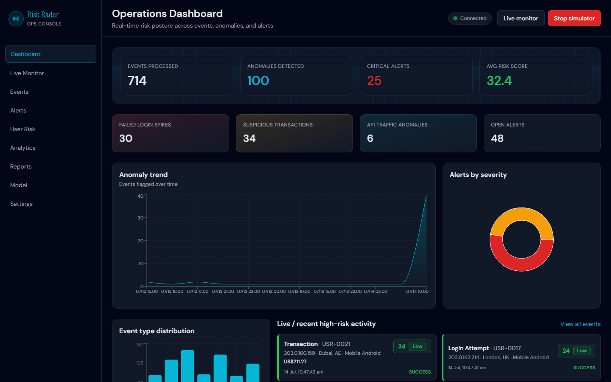
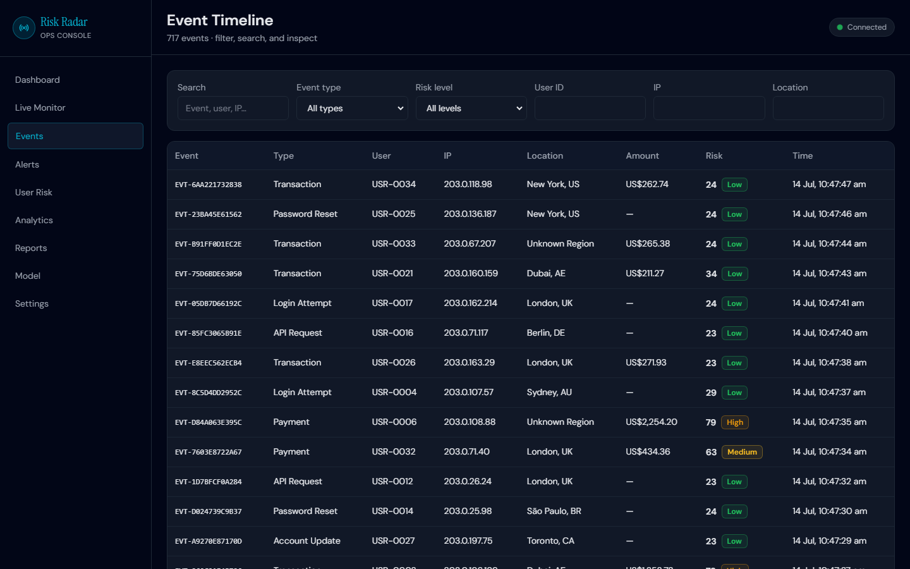
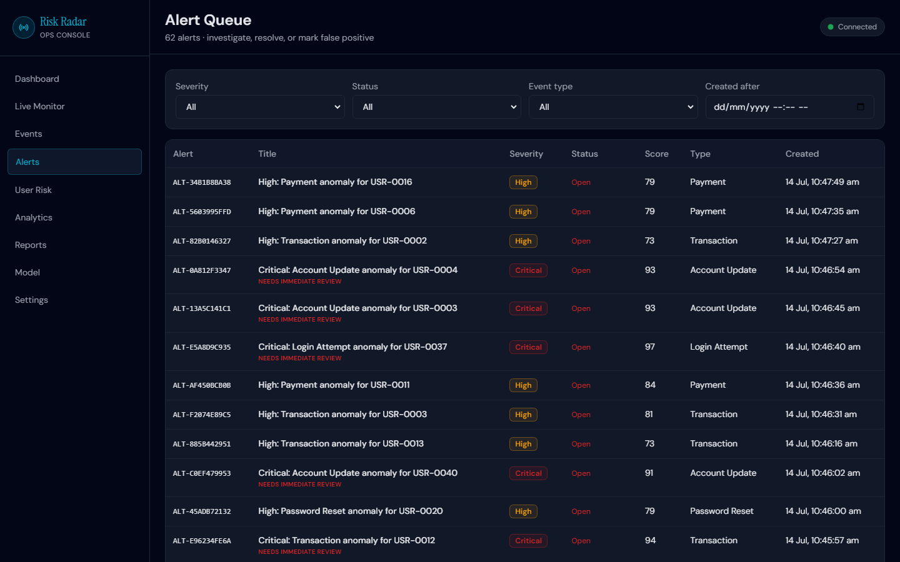
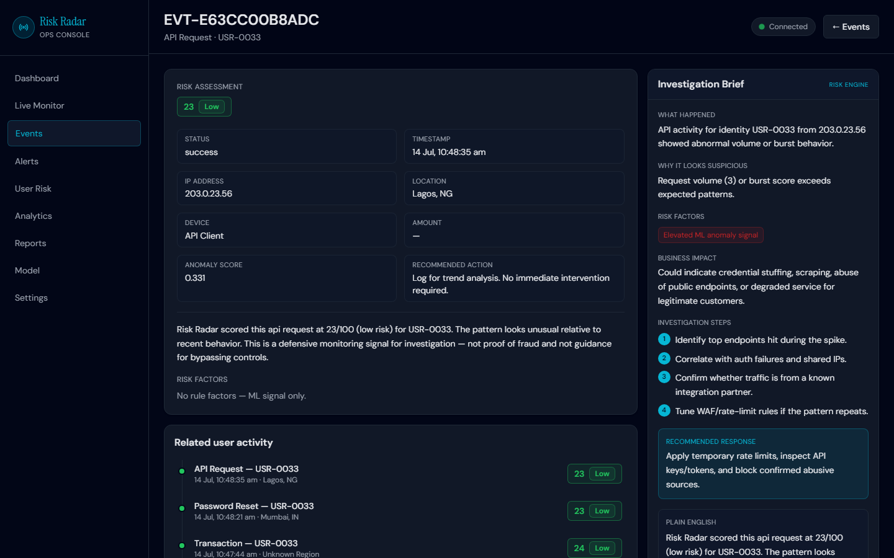

# Risk Radar: Real-Time Anomaly Detection Dashboard

Risk Radar is a full-stack demo for monitoring event data, identifying unusual activity, assigning risk scores, and helping analysts investigate alerts. It combines a scikit-learn Isolation Forest with explainable rule triggers, a FastAPI backend, a React dashboard, and optional Gemini-generated investigation summaries.

> **Project scope:** The bundled model is trained on synthetic data. A CSV imported into the app is scored and saved as events; it does not automatically become model training data. Treat the output as an investigation aid, not proof of fraud or a production decision system.

## What it does

- Scores login, payment, transaction, API, account, and system events.
- Combines Isolation Forest anomaly scores with readable rule-based risk factors.
- Streams simulator and imported events to the dashboard over WebSockets.
- Groups high-risk events into alerts and supports analyst notes and status updates.
- Produces investigation briefs with Gemini when configured, or local mock explanations otherwise.
- Includes analytics, reports, user risk profiles, and model status pages.

## Screenshots

| Dashboard | Live events |
| --- | --- |
|  |  |

| Alert queue | Anomaly explanation |
| --- | --- |
|  |  |

## Requirements

- Python 3.11 or newer
- Node.js 20 or newer and npm
- Optional: Docker and Docker Compose
- Optional: a Gemini API key for live AI summaries. Detection works without one.

## Run locally

Open two terminals from the project directory.

### 1. Set up and start the backend

```bash
cd backend
python -m venv .venv
```

Activate the environment, then install the Python dependencies:

```bash
# macOS / Linux
source .venv/bin/activate
python -m pip install -r requirements.txt
cp .env.example .env
```

```powershell
# Windows PowerShell
.venv\Scripts\Activate.ps1
python -m pip install -r requirements.txt
Copy-Item .env.example .env
```

Edit `backend/.env` if needed. `GEMINI_API_KEY` is optional; keep it private and do not commit `.env`.

Seed the local SQLite database with sample events and start the API:

```bash
python seed.py
python -m uvicorn main:app --reload --host 127.0.0.1 --port 8800
```

On Windows, run Uvicorn with `python -m uvicorn` in the activated environment as well. If the shell has an invalid `DEBUG` environment value, unset it before starting (macOS/Linux: `env -u DEBUG python -m uvicorn main:app --reload --host 127.0.0.1 --port 8800`; PowerShell: `Remove-Item Env:DEBUG`).

### 2. Set up and start the frontend

In a second terminal:

```bash
cd frontend
npm install
npm run dev
```

Open [http://localhost:5173](http://localhost:5173). The frontend defaults to the backend at `http://127.0.0.1:8800`.

Useful links:

- API health: [http://127.0.0.1:8800/api/health](http://127.0.0.1:8800/api/health)
- Interactive API docs: [http://127.0.0.1:8800/docs](http://127.0.0.1:8800/docs)

### Demo login

Seeding creates a demo account:

```text
Username: admin
Password: admin123
```

Change or remove demo credentials before exposing the application beyond your local machine.

## Use the built-in simulator

1. Open the dashboard and sign in.
2. Go to **Live Monitor** and start the simulator.
3. Review incoming events, anomaly scores, rule triggers, and alerts.
4. Open an event for its investigation brief.
5. Use **Reports** to generate and export a summary.

The simulator generates demo events. Stop it when you want to inspect a fixed dataset without new rows arriving.

## Use your own CSV dataset

The backend includes a CSV importer that submits each row to the event-analysis API. The importer scores and stores events using the same pipeline as live events. It does **not** retrain the Isolation Forest from the CSV.

### 1. Prepare the CSV

Create a CSV with at least these required columns:

| Column | Required | Description |
| --- | --- | --- |
| `event_type` | Yes | Event category, such as `Login Attempt`, `Transaction`, `Payment`, `API Request`, `Password Reset`, `Account Update`, or `System Event` |
| `user_id` | Yes | Stable user or entity identifier; pseudonymize it if needed |
| `timestamp` | No | ISO 8601 timestamp, for example `2026-09-17T14:30:00Z` |
| `ip_address` | No | Source IP address |
| `location` | No | Source location |
| `device` | No | Device or client description |
| `amount` | No | Numeric transaction/payment amount |
| `status` | No | Event result, such as `success` or `failed` |
| `metadata_json` | No | A JSON object containing extra behavioral features |

Example `events.csv`:

```csv
event_type,user_id,timestamp,ip_address,location,device,amount,status,metadata_json
Login Attempt,user-001,2026-09-17T14:30:00Z,203.0.113.8,"London, UK",Chrome,,failed,"{""failed_login_count"":8,""ip_repetition"":14,""event_velocity"":18}"
Payment,user-002,2026-09-17T14:34:00Z,198.51.100.22,Unknown Region,Mobile,2450.00,success,"{""user_avg_amount"":120,""unusual_location"":true,""new_device"":true}"
API Request,service-01,2026-09-17T14:38:00Z,192.0.2.18,Unknown,API Client,,success,"{""api_request_volume"":240,""burst_score"":7.2,""api_error_rate"":0.3}"
```

You can also provide supported metadata as separate CSV columns instead of putting it in `metadata_json`: `user_avg_amount`, `payment_failures`, `failed_login_count`, `impossible_travel`, `password_reset_count`, `api_request_volume`, `api_error_rate`, `burst_score`, `location_change`, `device_change`, `ip_repetition`, `users_from_ip`, `event_velocity`, `user_history_deviation`, `new_device`, `unusual_location`, and `account_change_after_risky_login`. Boolean values accept `true/false`, `yes/no`, or `1/0`. If a metadata feature exists both ways, the separate column takes precedence.

Put the CSV anywhere convenient. For example, from the project root:

```text
backend/data/events.csv
```

The `data/` directory is just a place to keep your local input; it is not uploaded to GitHub by this project.

### 2. Start the backend, then import

With the backend running on port 8800, open another terminal:

```bash
cd backend
python import_dataset.py data/events.csv
```

The importer prints progress every 100 rows and reports failed row numbers. Fix invalid rows and rerun them in a clean database if you need a complete import. To test with a small subset:

```bash
python import_dataset.py data/events.csv --limit 25
```

If your backend uses another address, set it explicitly:

```bash
python import_dataset.py data/events.csv --api-url http://127.0.0.1:8000/api/events/analyze
```

Imported rows appear in the dashboard’s event list and are broadcast to connected live dashboards. The model derives features from the provided event fields and metadata; missing fields use defaults. To get useful scores, map your dataset into the supported columns and provide baseline/context fields such as `user_avg_amount`, `failed_login_count`, `event_velocity`, `ip_repetition`, and `unusual_location` where available. Extra columns are ignored by the importer.

### 3. Inspect the results

- Use **Events** to browse imported rows and filter by risk level or event type.
- Open an event to review its score, rule triggers, factors, and investigation brief.
- Use **Alerts** and **Analytics** to investigate higher-risk patterns.
- `GET /api/events` returns paginated events; `GET /api/dashboard/stats` returns summary counts.

The system reports candidate anomalies; it does not consume a ground-truth label column or calculate precision/recall. Keep labels separately if you need to evaluate performance against known outcomes.

## Train or retrain the model

The **Model** page and `POST /api/model/train` train the Isolation Forest on the built-in synthetic training set. Uploaded CSV records are not used by that operation. Use the current model controls for demo retraining only; training on your own labeled/representative dataset requires adding a dataset-specific training and validation workflow.

## Configuration

Backend settings are read from `backend/.env`:

| Variable | Purpose |
| --- | --- |
| `DATABASE_URL` | Database URL; defaults to local SQLite |
| `CORS_ORIGINS` | Comma-separated allowed frontend origins |
| `JWT_SECRET` | Secret for demo authentication tokens; set a private value outside local development |
| `GEMINI_API_KEY` | Optional; enables Gemini-generated investigation summaries |
| `GEMINI_MODEL` | Gemini model; defaults to `gemini-2.5-flash` |

Frontend overrides can be set in `frontend/.env`:

| Variable | Purpose |
| --- | --- |
| `VITE_API_BASE` | Backend HTTP origin; defaults to `http://127.0.0.1:8800` |
| `VITE_WS_BASE` | Backend WebSocket origin; defaults to `ws://127.0.0.1:8800` |

Restart Vite after changing frontend environment variables.

## Docker Compose

Docker Compose starts PostgreSQL, the API, and the frontend. From the project root:

```bash
docker compose up --build
```

The backend container seeds demo data on startup. To enable Gemini in Docker, place `GEMINI_API_KEY=your-key` in a root-level `.env` file (next to `docker-compose.yml`); Compose does not read `backend/.env` for variable substitution. Open [http://localhost:5173](http://localhost:5173). Stop the services with `Ctrl+C`, or run `docker compose down` in another terminal.

## API overview

- `GET /api/health` — health check
- `GET /api/dashboard/stats` — dashboard metrics
- `GET /api/events` — paginated events and filters
- `POST /api/events/analyze` — analyze and store one event
- `GET /api/events/{id}/explanation` — generate an investigation brief
- `GET /api/alerts` — alert queue
- `GET /api/analytics/*` — analytics endpoints
- `GET /api/reports` and `POST /api/reports/generate` — reports
- `GET /api/model/status` and `POST /api/model/train` — model status/retrain (synthetic training data)
- `WS /ws/events` — live event stream

See `/docs` while the backend is running for request schemas and the full endpoint list.

## Troubleshooting

- **`ModuleNotFoundError`**: activate the backend virtual environment and run `python -m pip install -r requirements.txt` from `backend/`.
- **Port in use**: choose a free API port and update `VITE_API_BASE`, `VITE_WS_BASE`, and the importer `--api-url` to match.
- **Frontend cannot reach API**: confirm the backend health URL works and frontend API/WS URLs point to the same backend host and port.
- **Gemini summaries unavailable**: verify `GEMINI_API_KEY`; event scoring still works with mock summaries when the key is absent or the provider is temporarily unavailable.
- **No data shown**: run `python seed.py` once for demo data, or import your CSV after starting the backend.

## Tech stack

- Frontend: React, Vite, Tailwind CSS, Axios, Recharts
- Backend: FastAPI, SQLAlchemy, Pydantic, WebSockets
- Storage: SQLite by default; PostgreSQL via Docker Compose
- Machine learning: scikit-learn Isolation Forest, NumPy, Pandas
- Optional explanations: Google Gemini API

## License

MIT. See [LICENSE](LICENSE).
